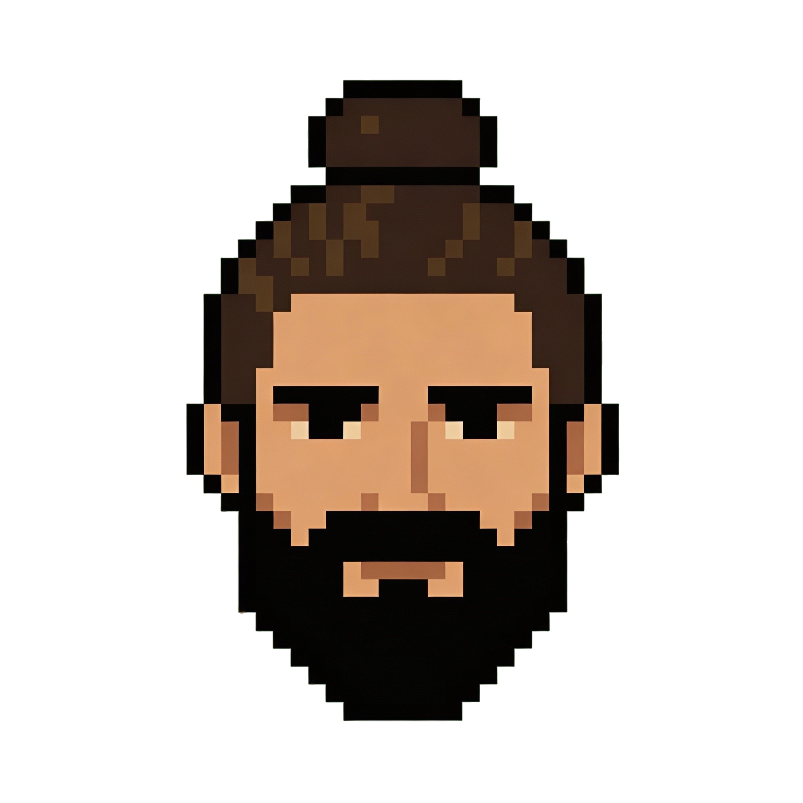

  
  <h1>Luis Antonio de Ben Dorado</h1>
  <h3>Desarrollador Web Full Stack | Especialista en IA | Automatizaciones</h3>

  
  
  

---

## Sobre mi

Desarrollador backend con **+15 anos de experiencia** construyendo sistemas robustos y escalables. Especializado en la integracion de **inteligencia artificial** y **automatizacion de procesos** en entornos empresariales.

Domino el ciclo completo de desarrollo: desde la arquitectura de APIs y la integracion de modelos de machine learning, hasta el despliegue automatizado con pipelines CI/CD.

---

## Tecnologias

| Area | Stack |
|------|-------|
| **Backend** | Node.js, Express, PHP, MySQL, REST APIs |
| **Frontend** | JavaScript, HTML, CSS, Bootstrap, jQuery |
| **Automatizacion** | n8n, GitHub Actions, HCP |
| **DevOps & Cloud** | Docker, CI/CD, Git |
| **Inteligencia Artificial** | Warp, Claude, OpenAI API, Ollama, LM Studio API |

---

## Experiencia profesional

### Desarrollador Fullstack Principal
**Nextpyme** - Sevilla, Espana (2005 - 2022)

Lidere el desarrollo tecnico de una empresa de software especializada en soluciones digitales para pymes, siendo responsable de la arquitectura, el rendimiento y la evolucion tecnologica de los productos.

- **Liderazgo tecnico fullstack**: desarrollo end-to-end con stack LAMP + JavaScript, jQuery, SCSS y Bootstrap
- **Arquitectura y modelado de datos**: diseno e implementacion de bases de datos MySQL optimizadas
- **Integracion de APIs**: conexion con servicios de terceros mediante APIs RESTful
- **Frontend y diseno UI**: interfaces responsive con SCSS y Bootstrap + identidad corporativa
- **Mentoria**: referente tecnico y coach para nuevos desarrolladores
- **Soporte al cliente**: atencion telefonica, remota e in situ con mantenimiento evolutivo

---

## Proyectos personales / Laboratorio tecnico

### Automatizacion con IA y RAG en entorno local
Infraestructura propia basada en Docker con flujos automatizados mediante n8n. Incluye un sistema RAG con base de datos vectorial Qdrant, integrado con modelos de lenguaje locales a traves de Ollama. Todo funciona sin dependencia de servicios externos en la nube.

`Docker` `n8n` `Ollama` `Qdrant` `RAG` `Webhook` `LLM local`

### Desarrollo de MCP con acceso a base de datos
Servidor MCP (Model Context Protocol) en Node.js con integracion a MySQL local mediante API propia. Conectado con agentes de IA para habilitar operaciones completas sobre la base de datos desde los propios agentes.

`Node.js` `Express` `MySQL` `REST API` `MCP` `Agentes IA`

---

## Formacion academica

| Titulo | Centro | Ano |
|--------|--------|-----|
| Master en desarrollo con IA | BigSchool | 2025 - Actualidad |
| Automatizaciones con n8n e IA | Raiola Networks | 2025 |
| GDPymes - IA, Big Data y herramientas digitales | Adams | 2025 |
| Tecnico Superior en desarrollo de aplicaciones | Instituto Julio Verne | 2003 - 2005 |
| FP Grado medio en desarrollo de aplicaciones | Academia Claustro | 2003 |

---

  Coded with &#9829; and pixels

